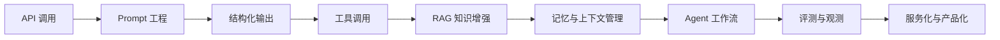

# 大模型应用演进学习路线

这份文档用于指导本项目的长期演进：从最简单的 API 调用开始，逐步理解 Prompt 工程、结构化输出、函数调用、RAG、Agent、评测、部署和产品化，最后做出一个自己日常真正能用的 AI 服务。

核心目标不是“堆功能”，而是理解每一代技术为什么出现、解决了什么问题、又留下了什么新问题。

## 总体路线



## 阶段 1：最小 API 调用

### 要解决的问题

先搞清楚大模型 API 的基本调用方式：模型、消息、参数、流式输出、错误处理。

这一阶段的重点不是效果，而是建立最小闭环：我输入一句话，模型返回一句话。

### 要学习的能力

- OpenAI 兼容 API 的调用方式
- `model`、`messages`、`temperature`、`top_p`、`max_tokens` 的作用
- 流式输出和普通输出的区别
- API Key、Base URL、环境变量管理

### 项目实验

当前项目的 `Step1/llm_chat.py` 就是这一阶段。

建议继续补充：

- 支持命令行选择模型
- 支持非流式和流式两种模式
- 增加统一错误提示
- 把不同模型的调用配置整理成字典

### 阶段产物

一个可以稳定调用多个模型的小脚本。

## 阶段 2：Prompt 工程

### 要解决的问题

同一个模型，提示词写法不同，效果会明显不同。Prompt 工程的价值是把“随便问”变成“有目标、有约束、有格式、有上下文地问”。

但 Prompt 工程不能从根本上解决幻觉，因为模型仍然主要依赖训练参数和当前上下文生成答案。

### 要学习的能力

- 角色设定：告诉模型扮演什么角色
- 任务拆解：把复杂任务拆成步骤
- 输出约束：要求固定格式、长度、语气、字段
- 示例学习：给模型少量样例
- 反思检查：让模型先列假设、再回答

### 项目实验

新增 `Step2/prompt_engineering.py`：

- 同一个问题，用普通 Prompt、角色 Prompt、结构化 Prompt 分别调用
- 对比输出质量
- 总结哪些提示词能稳定提升效果，哪些只是“看起来更认真”

### 推荐实验问题

- “帮我总结这段文章”
- “帮我写一个学习计划”
- “帮我分析这个报错”
- “帮我把需求拆成开发任务”

### 阶段产物

一组可复用 Prompt 模板，例如：

- 总结模板
- 代码解释模板
- 学习计划模板
- 需求拆解模板

## 阶段 3：结构化输出

### 要解决的问题

自然语言回答适合阅读，但不适合程序继续处理。真实应用里，我们经常希望模型输出 JSON、表格字段、分类结果、任务列表。

这一阶段开始从“聊天”走向“可编程 AI”。

### 要学习的能力

- 要求模型输出 JSON
- 用 Pydantic 校验模型输出
- 处理模型输出不合法 JSON 的情况
- 将模型结果传给后续程序

### 项目实验

新增 `Step3/structured_output.py`：

- 输入一段用户需求
- 模型输出结构化任务列表
- 程序校验字段
- 输出校验后的结果

示例结构：

```json
{
  "goal": "学习 RAG",
  "tasks": [
    {
      "title": "理解向量数据库",
      "priority": "high",
      "estimated_hours": 2
    }
  ]
}
```

### 阶段产物

一个能把自然语言转成结构化数据的小工具。

## 阶段 4：工具调用

### 要解决的问题

模型本身不会真正执行动作。它可以“说”要查文件、算数字、搜索知识，但真正的执行需要外部工具。

工具调用让模型从“回答者”变成“调度者”。

### 要学习的能力

- Function Calling / Tool Calling 的基本思想
- 工具 schema 如何设计
- 模型什么时候应该调用工具
- 工具结果如何返回给模型继续推理

### 项目实验

新增 `Step4/tool_calling.py`：

- 做一个简单工具：读取本地文件摘要
- 做一个计算工具：统计文本字数或计算表达式
- 让模型根据问题决定是否调用工具

### 阶段产物

一个模型可以调用本地工具完成任务的最小 Demo。

## 阶段 5：RAG 知识增强

### 要解决的问题

Prompt 工程不能解决模型不知道最新信息、私有信息、项目内部知识的问题。RAG 的核心思路是：先检索相关资料，再让模型基于资料回答。

这一步是从“模型凭记忆回答”转向“模型基于证据回答”。

### 要学习的能力

- 文档切分 Chunking
- Embedding 向量化
- 相似度检索
- Top-K 召回
- 基于引用内容回答
- 处理“资料中没有答案”的情况

### 项目实验

新增 `Step5/rag/`：

- `data/`：存放自己的文档、笔记、文章
- `index_docs.py`：把文档切分并建立索引
- `query_docs.py`：输入问题，检索相关片段，再让模型回答

### 推荐从这些知识源开始

- 自己的学习笔记
- 项目 README
- 常用命令记录
- 工作中的 SOP 文档
- 常见报错和解决方案

### 阶段产物

一个“问自己的资料库”的本地知识问答工具。

## 阶段 6：记忆与上下文管理

### 要解决的问题

模型上下文窗口有限，不能无限记住所有历史。真实服务需要区分短期上下文、长期记忆、用户偏好和任务状态。

### 要学习的能力

- 对话历史裁剪
- 摘要式记忆
- 用户偏好保存
- 会话状态管理
- 哪些信息该记，哪些信息不该记

### 项目实验

新增 `Step6/memory/`：

- 保存用户历史问题
- 自动总结长期偏好
- 在下次回答时注入相关记忆

### 阶段产物

一个能记住你学习偏好和常见需求的助手。

## 阶段 7：Agent 工作流

### 要解决的问题

单次问答适合简单任务，但复杂任务需要规划、执行、检查、修正。Agent 的价值在于让模型围绕目标持续使用工具完成多步任务。

### 要学习的能力

- 任务规划
- 多步执行
- 工具选择
- 中间结果检查
- 失败重试
- 人类确认节点

### 项目实验

新增 `Step7/agent_workflow.py`：

- 输入一个目标，例如“帮我整理这周学习笔记”
- Agent 拆任务
- 读取资料
- 总结内容
- 生成结果
- 做一次自检

### 阶段产物

一个能完成多步骤学习任务的小 Agent。

## 阶段 8：评测与观测

### 要解决的问题

大模型应用很容易“看起来能用”，但一改 Prompt、模型或检索策略就效果波动。需要评测体系来判断质量是否真的提升。

### 要学习的能力

- 构建测试问题集
- 人工评分标准
- 自动化评测
- 检索命中率
- 幻觉率
- 响应时间和成本统计

### 项目实验

新增 `evals/`：

- `questions.jsonl`：固定测试问题
- `run_eval.py`：批量运行
- `report.md`：输出结果

### 阶段产物

一个能比较 Prompt、模型、RAG 策略效果的评测脚本。

## 阶段 9：服务化与产品化

### 要解决的问题

脚本适合学习，但自己日常使用需要服务化：有界面、有接口、有数据存储、有部署方式。

### 要学习的能力

- FastAPI 后端
- 简单 Web UI
- 用户输入与会话管理
- 文件上传
- RAG 查询接口
- 部署到本地或云服务器

### 项目实验

新增 `app/`：

- `api/`：后端接口
- `web/`：前端页面
- `storage/`：本地数据
- `services/`：模型、RAG、记忆、工具调用逻辑

### 阶段产物

一个自己平时可以用的 AI 服务。

## 最终服务方向建议

结合你的目标，这个项目最终可以演进成一个“个人 AI 学习与工作助手”。

### 核心功能

- 问答：可以问大模型通用问题
- 知识库：可以问自己的文档和笔记
- 学习路线：帮你拆解学习目标
- 项目助手：读取当前项目代码，解释文件和报错
- 任务整理：把想法整理成 Todo、计划、文档
- 复盘：记录每天学了什么，自动总结薄弱点

### 一个很适合你的最终形态

你可以把它做成：

```text
个人 AI 学习操作台

1. 输入今天想学什么
2. 系统根据你的历史记录和资料库生成学习计划
3. 你边学边提问
4. 系统把关键知识自动整理进知识库
5. 每周自动生成复盘和下一步建议
```

这个方向能把 API、Prompt、RAG、Agent、记忆、评测、服务化全部自然串起来。

## 推荐项目目录演进

```text
AILearn/
├── Step1/
│   └── llm_chat.py
├── Step2/
│   └── prompt_engineering.py
├── Step3/
│   └── structured_output.py
├── Step4/
│   └── tool_calling.py
├── Step5/
│   └── rag/
├── Step6/
│   └── memory/
├── Step7/
│   └── agent_workflow.py
├── app/
│   ├── api/
│   ├── web/
│   ├── services/
│   └── storage/
├── evals/
├── docs/
└── README.md
```

## 学习节奏建议

每个阶段都按同一个节奏推进：

1. 先写一个最小可运行 Demo
2. 记录它解决了什么问题
3. 记录它解决不了什么问题
4. 引出下一阶段技术
5. 把上一阶段代码整理成可复用模块

这样学出来的不是“教程知识”，而是一条真实的大模型应用进化链。

## 下一步建议

下一步可以从 `Step1` 继续，把当前脚本整理成更清晰的模型调用层：

- `config.py`：读取环境变量
- `models.py`：管理不同模型配置
- `chat.py`：统一聊天调用
- `cli.py`：命令行入口

整理完以后，再进入 `Step2 Prompt 工程`，开始做不同 Prompt 策略的对比实验。
